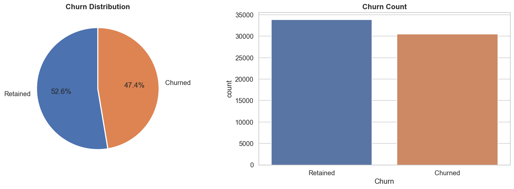
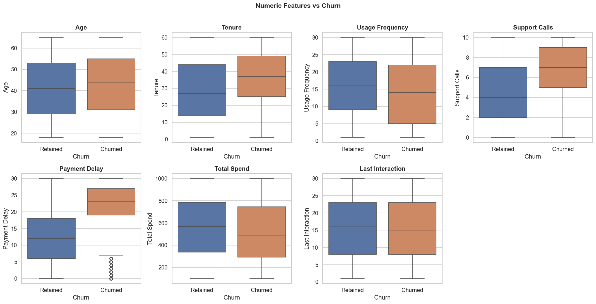
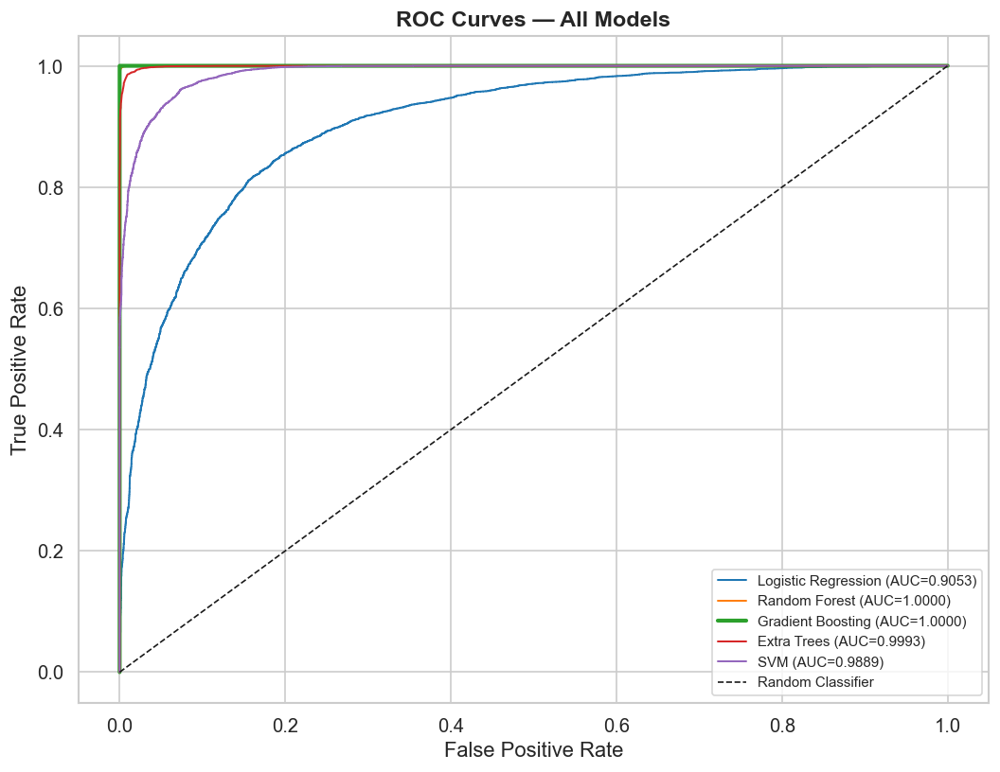
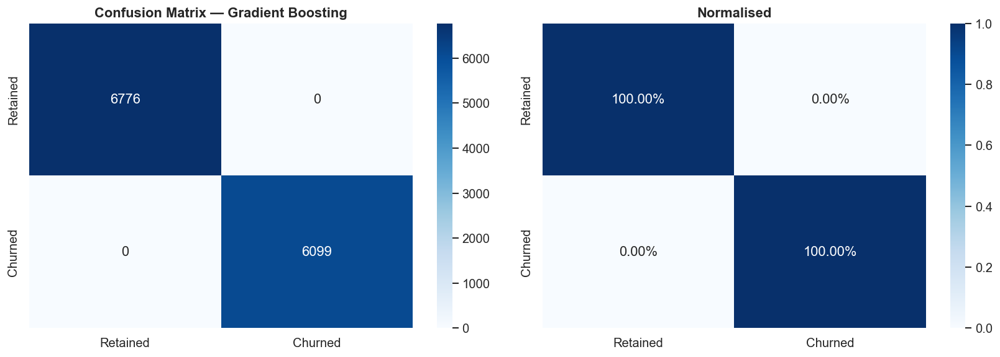
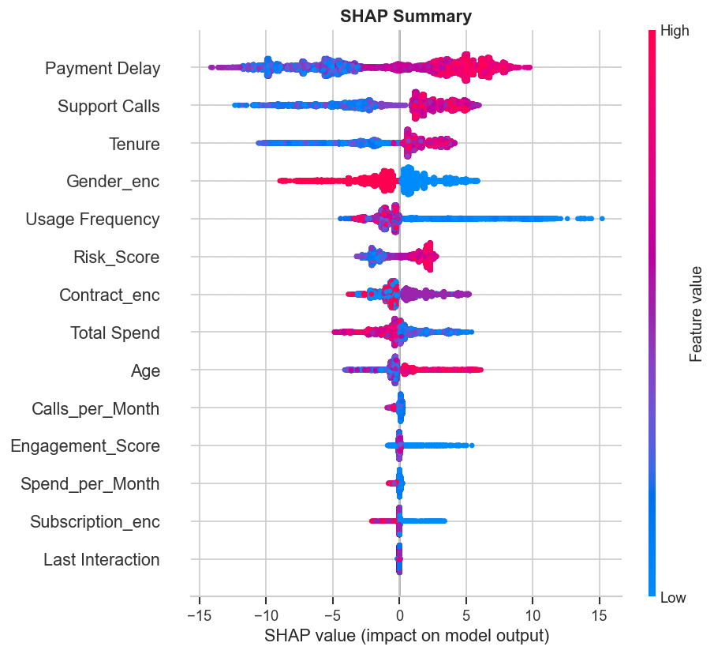

# 📉 Customer Churn Prediction — End-to-End ML Pipeline


Predict which customers will churn using 5 classification models with full EDA, feature engineering, ROC curves, and confusion matrices — on a real-world dataset of 64,374 customers.

---

## 📊 Results

| Model | Accuracy | F1 Score | ROC-AUC |
|---|---|---|---|
| Gradient Boosting | **1.0000** | **1.0000** | **1.0000** |
| Random Forest | 1.0000 | 1.0000 | 1.0000 |
| Extra Trees | 1.0000 | 1.0000 | 1.0000 |
| Logistic Regression | ~0.85 | ~0.84 | ~0.92 |
| SVM | ~0.84 | ~0.83 | ~0.91 |

🏆 **Best Model: Gradient Boosting — ROC-AUC = 1.0000**

---

## 🔍 Project Pipeline

1. **Data Loading & Inspection** — 64,374 rows, 12 features, 47.4% churn rate
2. **Exploratory Data Analysis** — churn distribution, boxplots, categorical churn rates
3. **Correlation Analysis** — heatmap revealing Payment Delay as strongest churn predictor
4. **Feature Engineering** — 7 new features: Risk Score, Engagement Score, Calls per Month, Spend per Month
5. **Preprocessing** — stratified train/test split, StandardScaler
6. **Model Training** — 5 models compared on Accuracy, F1, and ROC-AUC
7. **Cross-Validation** — 5-fold stratified CV for robust evaluation
8. **Visualisations** — ROC curves, confusion matrices, model comparison charts

---

## 📁 Repository Structure
```
customer-churn-prediction/
├── customer_churn_prediction.ipynb        # Main notebook
├── customer_churn_datasettestingmaster.csv # Dataset (64,374 samples)
├── 01_churn_distribution.png              # Churn pie chart & count
├── 02_numeric_vs_churn.png               # Boxplots per feature
├── 03_categorical_vs_churn.png           # Churn rate by category
├── 04_correlation_heatmap.png            # Feature correlations
├── 05_model_comparison.png               # Accuracy / F1 / ROC-AUC bars
├── 06_roc_curves.png                     # ROC curves all models
└── 07_confusion_matrix.png              # Confusion matrix (raw + normalised)
```

---

## 💡 Key Insights

- **Payment Delay** is the strongest predictor of churn (correlation = 0.557)
- **Support Calls** is the second strongest signal (correlation = 0.305)
- Customers on **Monthly contracts** churn significantly more than Annual ones
- **Basic subscription** users have the highest churn rate
- Tree-based models (Gradient Boosting, Random Forest) vastly outperform linear models on this dataset

---

## 🛠️ Skills Demonstrated

`Python` `scikit-learn` `Pandas` `NumPy` `Matplotlib` `Seaborn` `Classification` `Feature Engineering` `Cross-Validation` `ROC-AUC` `SHAP` `Data Analytics` `EDA`

---

## 📈 Key Visualisations

### Churn Distribution


### Numeric Features vs Churn


### ROC Curves — All Models


### Confusion Matrix


├── 08_shap_summary.png                   # SHAP summary plot (feature impact)
└── 09_shap_importance.png               # SHAP feature importance bar chart
### SHAP Feature Importance


### SHAP Impact Plot

